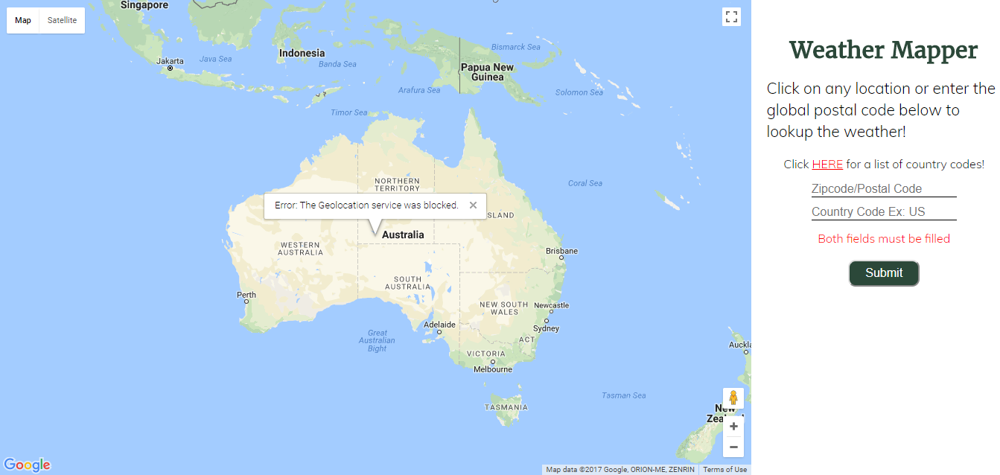
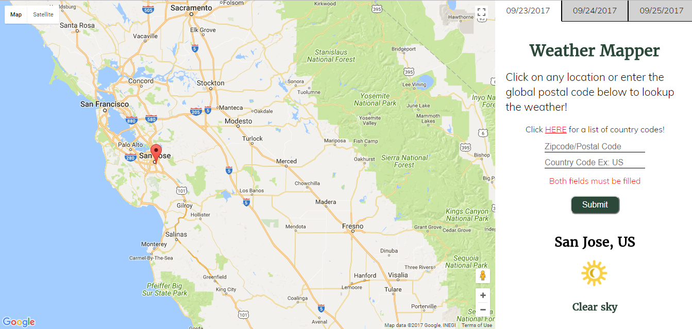

# Weather Mapper
by Kyle Szeto

## Live Demo
https://weatherbit-google-app.netlify.com/

## Description
A web app that allows you to search for the weather today, tomorrow, and the day 
after tomorrow by clicking on the map or entering the correct global postal code.

## Stack
**Frontend**: HTML, CSS, JavaScript, jQuery, Google Maps API, Weatherbit.io API  
**Deployment**: Netlify  

**Note**  Weatherbit.io only allows 75 calls to their API per hour and rounds the lat and lng of certain points  

## How to Use The Code
* Fork it to your Repo
* Git clone the Repo link
* Find the file in your folder
* Open it in your browser

## Screenshots
#### Home Screen  
When you start the website, you will be directed to the introduction screen of what the app does. 
  

#### Main Screen  
When you click on get started, you will be directed to the a page with google maps. 
You will be prompted to give your location. It is up to you if you do or don't. 
  

#### Main Screen2  
After you answer the location question, you can either 
click anywhere on the map or enter a valid global postal code to get 
the weather at that location 
  

